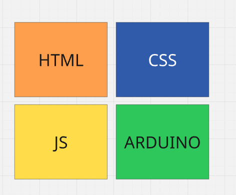
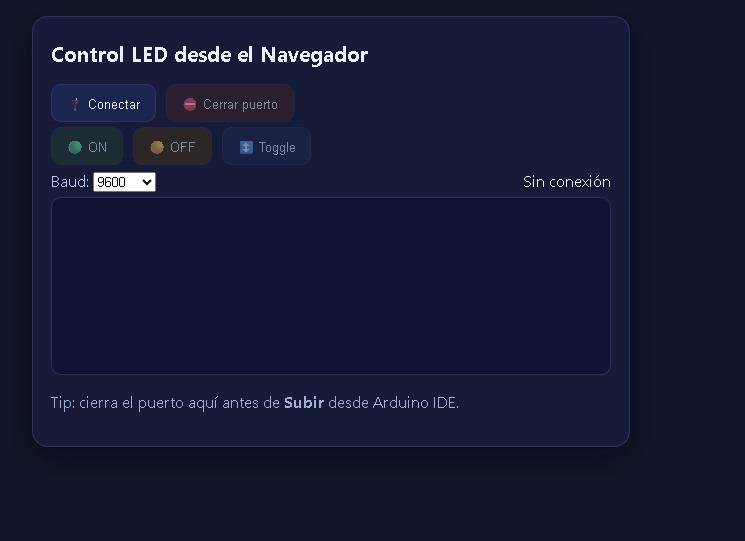
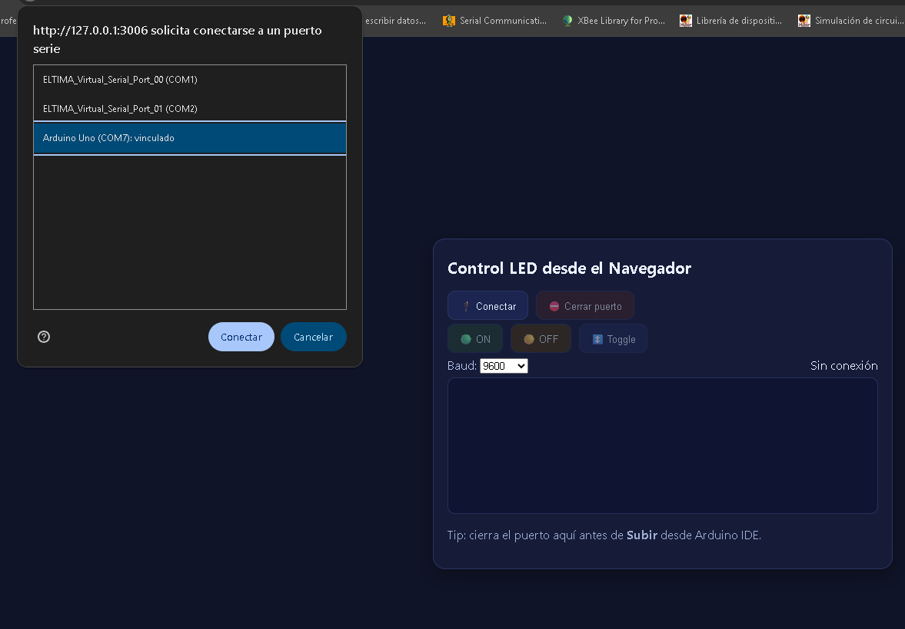
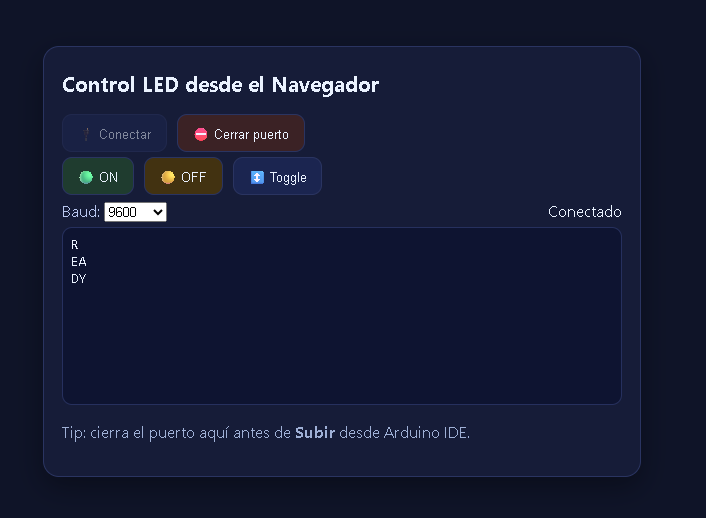
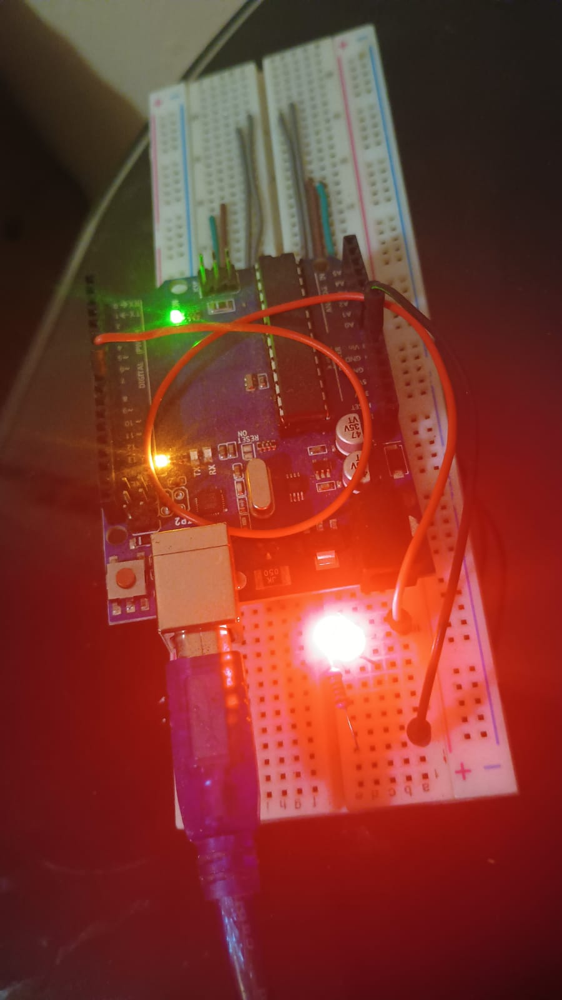

# Control de LED desde el Navegador 🖥️💡

Control de encendido y apagado de un LED conectado a un Arduino **directamente desde el navegador** usando la **Web Serial API**.  
La interfaz es una pequeña consola web donde puedes:

- Conectar / desconectar el puerto serie.
- Enviar comandos `ON`, `OFF` y `Toggle`.
- Ver en tiempo real los mensajes que envía el Arduino.

> ⚠️ Este proyecto funciona solo en navegadores basados en Chromium (Chrome, Edge, Brave, Opera…) y **bajo HTTPS o `localhost`**.

---



## 📸 Capturas de pantalla


- Vista principal de la aplicación  
  

- Selección del puerto serie del Arduino  
  

- Conexión establecida y mensaje READY  
  

- LED encendido desde el botón ON  
  

---

## Código Arduino

 1  // Control LED por comandos Serial: "ON" / "OFF" (+ Enter)
 2  // Baud: 9600
 3
 4  int LED = 8;
 5  String cmd;
 6
 7  void setup() {
 8    pinMode(LED, OUTPUT);
 9    digitalWrite(LED, LOW);
10    Serial.begin(9600);
11    Serial.println("READY");
12  }
13
14  void loop() {
15    while (Serial.available()) {
16      char c = Serial.read();
17
18      if (c == '\n' || c == '\r') {
19        if (cmd.length()) {
20          cmd.trim();
21          cmd.toUpperCase();
22
23          if (cmd == "ON" || cmd == "1") {
24            digitalWrite(LED, HIGH);
25            Serial.println("OK:ON");
26
27          } else if (cmd == "OFF" || cmd == "0") {
28            digitalWrite(LED, LOW);
29            Serial.println("OK:OFF");
30
31          } else if (cmd == "TOGGLE" || cmd == "T") {
32            digitalWrite(LED, !digitalRead(LED));
33            Serial.println("OK:TOGGLE");
34
35          } else {
36            Serial.println("ERR:CMD");
37          }
38
39          cmd = "";
40        }
41      } else {
42        cmd += c;
43      }
44    }
45  }


## 🧩 Estructura del proyecto

```text
control-arduino-web/
├── index.html      # Interfaz web
├── styles.css      # Estilos (tema oscuro)
└── app.js          # Lógica de comunicación serie y manejo de la UI
